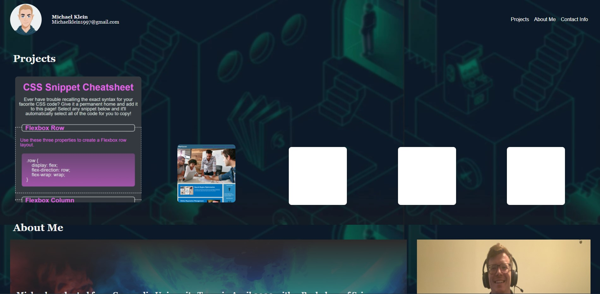

# Michael Klein's Professional Portfolio

## Description
This webpage serves to provide a centralized webpage that is responsive to different screen sizes to showcase deployed web appliations created by junior web developer, Michael Klein.  HTML and Advanced CSS were utilized to create this project.  The creator's intention is to further implement new skills, like Javascript, into this webpage as he progress through his coding bootcamp.

## [URL to Deployed Application](https://inklein1997.github.io/Professional-Portfolio-V2/)

## [URL to Github Repository](https://github.com/inklein1997/Professional-Portfolio-V2)

## Screenshot of Application

---

---

## Acknowledgements:

skeleton .overlay code provided by [w3schools](https://www.w3schools.com/howto/tryit.asp?filename=tryhow_css_image_overlay_slidebottom)

avatar generated by avatarmaker.com

skeleton shadow box border provided by UT Austin Coding Bootcamp curriculum